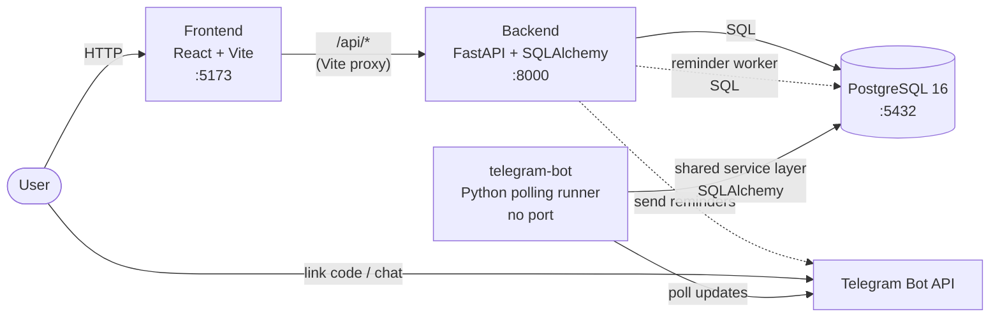
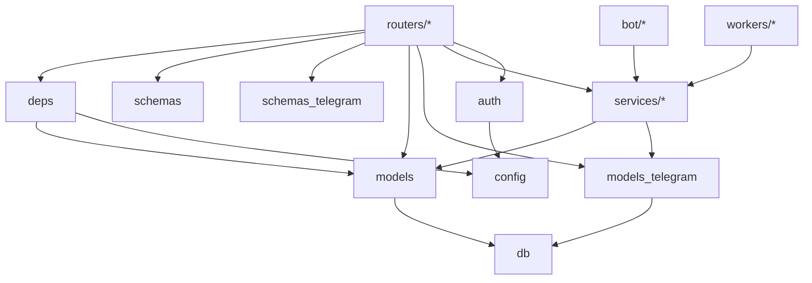
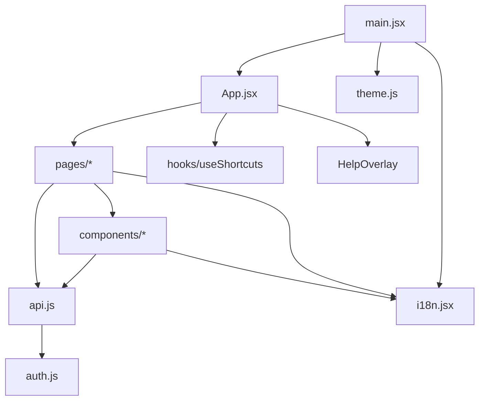
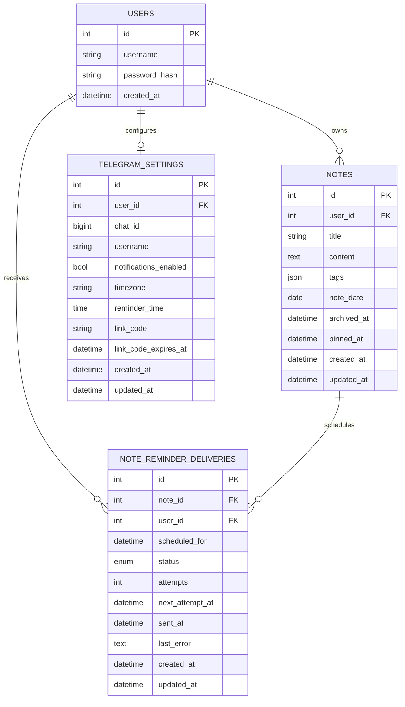

# Architecture

A small, single-user-per-account notes app. The repository is a Docker Compose
stack: database, migrations, backend, frontend, and an optional Telegram bot
runner for reminders.

## System overview



| Service        | Stack                                              | Port | Role                                                       |
| -------------- | -------------------------------------------------- | ---- | ---------------------------------------------------------- |
| `db`           | Postgres 16                                        | 5432 | Durable storage                                            |
| `migrations`   | Python 3.11, Alembic                               | -    | One-shot schema migration before app services start         |
| `backend`      | Python 3.11, FastAPI, SQLAlchemy 2.0, Alembic, JWT | 8000 | REST API, auth, data access, reminder worker lifecycle      |
| `telegram-bot` | Python 3.11, python-telegram-bot                   | -    | Optional polling runner; links Telegram chats via shared DB |
| `frontend`     | React 18, Vite, React Router                       | 5173 | SPA; dev server proxies `/api` to `backend`                 |

The frontend talks to the backend through the Vite dev proxy in local Compose;
there is no direct browser-to-backend call in dev. Telegram support is optional:
without bot configuration the REST API still runs, the frontend hides Telegram
settings, and the bot runner/worker stay inactive.

## Components & responsibilities

### Services

- **`db`** - owns all persistent state. No logic lives here beyond schema
  (managed by Alembic) and ownership indexes. External deps: none. Data volume:
  `db_data`.
- **`migrations`** - applies Alembic migrations once and exits. Application
  services depend on it instead of running migrations independently.
- **`backend`** - the only long-running HTTP component allowed to talk to `db`.
  Owns authentication (JWT issuing and verification), authorization (per-row
  `user_id` filtering), domain logic (notes, tags, calendar aggregation,
  archive/pin semantics, pagination), Telegram settings, Telegram reminder
  delivery records, request validation (Pydantic), and the lightweight in-process
  reminder worker lifecycle.
- **`telegram-bot`** - optional Python runner with no exposed port. It polls
  Telegram updates, accepts short link codes from users, and completes linking by
  calling the same backend service layer and database models used by HTTP routes.
- **`frontend`** - a pure SPA. Holds no server state; the JWT in `localStorage`
  is its only persistent local state. Talks only to `/api/*` via the Vite dev
  proxy. Owns layout, user interaction, optimistic UX affordances (markdown
  preview, keyboard shortcuts, calendar rendering), and Telegram settings UI
  visibility based on `is_configured`.

### Backend packages



- **`app/main.py`** - process entry point. Mounts CORS, routers, `/healthz`, and
  starts/stops the reminder worker through lifespan hooks.
- **`app/config.py`** - single source of truth for runtime configuration
  (`DATABASE_URL`, `JWT_SECRET`, `TELEGRAM_BOT_TOKEN`,
  `TELEGRAM_BOT_USERNAME`, etc.). Everything else imports `settings` from here.
- **`app/db.py`** - owns the SQLAlchemy engine, session factory, and `Base`
  (DeclarativeBase). Nothing else instantiates engines.
- **`app/models.py`** - core ORM entities (`User`, `Note`) and relationships.
- **`app/models_telegram.py`** - Telegram ORM entities: `TelegramSettings` and
  `NoteReminderDelivery`, including delivery status and idempotency constraints.
- **`app/schemas.py`** - core Pydantic DTOs for request bodies and responses.
- **`app/schemas_telegram.py`** - Telegram DTOs for settings, link codes, and
  test notification responses.
- **`app/auth.py`** - password hashing (bcrypt) and JWT encoding. Pure functions;
  no I/O.
- **`app/deps.py`** - FastAPI dependencies: `get_db` (per-request session
  lifecycle) and `get_current_user` (JWT to `User`). Every protected route goes
  through `get_current_user`.
- **`app/routers/*`** - HTTP surface. Each router owns one area (`auth`,
  `account`, `notes`, `tags`, `telegram_settings`). Routers never import each
  other.
- **`app/services/telegram_settings.py`** - link code generation, code-based
  linking, settings defaults, connection state, and disconnect behavior.
- **`app/services/telegram_notifications.py`** - Telegram Bot API message
  delivery and error mapping.
- **`app/services/reminders.py`** - due-note scanning, reminder scheduling,
  idempotent delivery reservation, retry metadata, and message construction.
- **`app/workers/reminder_worker.py`** - lightweight in-memory worker manager
  that starts only when Telegram is configured and at least one linked user has
  notifications enabled.
- **`app/bot/*`** - Telegram polling entry point, handlers, and user-facing bot
  messages.
- **`alembic/versions/*`** - schema migrations, applied by the `migrations`
  service. Must be reversible (both `upgrade` and `downgrade`).
- **`scripts/seed.py`** - idempotent demo data (wipes the demo user, recreates).
- **`scripts/dump_openapi.py`** - emits `app.openapi()` JSON; drives
  `make openapi-dump` and the drift test.

### Frontend packages



- **`main.jsx`** - app bootstrap: calls `initTheme()`, wraps the tree in
  `LangProvider` and `BrowserRouter`.
- **`App.jsx`** - route map, top-level header, global shortcut wiring, registers
  actions forwarded from `Notes.jsx` (new/search/save) so shortcuts can reach
  them.
- **`api.js`** - the single network boundary. Centralizes `Authorization` header,
  401-triggered token clear, and JSON envelope. No page talks to `fetch`
  directly.
- **`auth.js`** - JWT in `localStorage`. Tiny, deliberate boundary.
- **`theme.js`** - `light` / `dark` / `system` via a `data-theme` attribute on
  `<html>`. Listens to `prefers-color-scheme` when the preference is `system`.
- **`i18n.jsx`** - React Context provider, `t(key, vars)` hook, EN fallback when
  RU is missing. The only translation mechanism.
- **`hooks/useShortcuts.js`** - global `keydown` listener; ignores editable
  targets except for `Cmd/Ctrl+S`.
- **`hooks/useTelegramSettingsCard.js`** - Settings-page orchestration for
  Telegram state, link-code polling, preference saves, tests, and disconnect.
- **`components/*`** - presentational + small behavior: `NoteEditor`,
  `NoteList`, `TagFilter`, `ThemeToggle`, `LanguageToggle`, `MarkdownToolbar`,
  `HelpOverlay`, Telegram settings panels.
- **`pages/*`** - screens with data-fetching and orchestration: `Login`,
  `Register`, `Notes` (list + editor + bulk + pagination + pin/archive),
  `Calendar`, `Settings`.

### Dependency rules worth keeping

- `routers/*` may depend on `deps`, `schemas`, `schemas_telegram`, `models`,
  `models_telegram`, `services/*`, and `auth`; they must not depend on each
  other.
- Base notes/auth routers must not mix in Telegram-specific logic. Telegram HTTP
  behavior belongs in `routers/telegram_settings.py`, and shared Telegram logic
  belongs in `services/*`, `workers/*`, or `bot/*`.
- `models` and `models_telegram` depend only on `db`. Business logic does not
  live in ORM models.
- Frontend `components/*` stay presentational; fetching lives in `pages/*` or
  dedicated hooks.
- `api.js` is the only module that calls `fetch`.
- Any new environment variable flows through `app/config.py` on the backend and
  through `import.meta.env` (`VITE_...`) on the frontend; never read directly
  from `process.env` or `localStorage` in business code.

## Data model



- **Tags** are a JSON array on the note itself. The `/tags` endpoint derives the
  per-user list by scanning the user's notes. There is no separate `tags` table
  by design.
- **Ownership** is enforced in every query via `user_id = current_user.id`.
  There is no sharing model and no RBAC.
- **Soft-delete** uses `archived_at` (nullable timestamp). Default list view
  excludes archived.
- **Pinning** uses `pinned_at` (nullable timestamp). Non-null notes sort on top.
- **Telegram settings** are one row per user. They hold the linked Telegram chat
  id, Telegram username, notification toggle, IANA timezone, reminder time, and
  short link code with expiry.
- **Reminder deliveries** are one row per note/scheduled reminder. They hold
  status, attempts, next retry time, sent timestamp, and last error metadata.
  The unique `(note_id, scheduled_for)` constraint is the DB-level idempotency
  boundary.

## Runtime behavior

### Telegram reminders flow

1. Telegram env vars are optional. Without `TELEGRAM_BOT_TOKEN` and
   `TELEGRAM_BOT_USERNAME`, the backend reports `is_configured = false`, the
   frontend hides Telegram settings, the bot runner does not poll, and the
   reminder worker stops.
2. A user opens Settings, generates a 6-digit link code, and sends the code to
   the configured Telegram bot.
3. The `telegram-bot` runner polls Telegram updates and completes linking by
   matching the code in `TelegramSettings`.
4. The user enables notifications and chooses timezone/reminder time.
5. The backend reminder worker starts only when a bot token exists and at least
   one linked user has notifications enabled.
6. The worker scans due dated, non-archived notes, reserves a delivery row, sends
   the Telegram message, then marks the row sent or failed with retry metadata.

Architectural caveats:

- The reminder worker is an in-memory asyncio task and is suitable for a single
  backend process. Multiple backend processes would need external coordination
  or a dedicated queue/worker.
- Delivery is idempotent at the DB level, but exact-once cannot be guaranteed
  across a crash after Telegram accepts a message and before the database commit
  marks it sent.
- Failed Telegram deliveries remain available for retry. A failed send does not
  automatically unlink the user.

## Backend layout

```text
backend/
|-- app/
|   |-- main.py                     FastAPI app, CORS, router mounts, /healthz, worker lifecycle
|   |-- config.py                   pydantic-settings, env-driven (.env)
|   |-- db.py                       engine + SessionLocal + DeclarativeBase
|   |-- models.py                   core ORM: User, Note
|   |-- models_telegram.py          TelegramSettings, NoteReminderDelivery
|   |-- schemas.py                  core Pydantic in/out schemas
|   |-- schemas_telegram.py         Telegram settings/link/test DTOs
|   |-- auth.py                     bcrypt hashing, JWT encode
|   |-- deps.py                     get_db, get_current_user (JWT to User)
|   |-- routers/
|   |   |-- auth.py                 /auth/register, /auth/login
|   |   |-- account.py              /account/change-password, DELETE /account
|   |   |-- notes.py                /notes CRUD, calendar, archive, pin, bulk-delete
|   |   |-- tags.py                 /tags
|   |   `-- telegram_settings.py    /settings/telegram endpoints
|   |-- services/
|   |   |-- reminders.py            due-note scan, idempotency, retry state
|   |   |-- telegram_notifications.py Telegram Bot API delivery
|   |   `-- telegram_settings.py    settings, link codes, connection state
|   |-- workers/
|   |   `-- reminder_worker.py      in-process reminder worker manager
|   `-- bot/
|       |-- main.py                 Telegram polling runner
|       |-- handlers.py             /start and link-code handlers
|       `-- messages.py             bot response strings
|-- alembic/versions/               schema migrations
|-- scripts/
|   |-- seed.py                     demo user + sample notes (make seed)
|   `-- dump_openapi.py             regenerates openapi.json (make openapi-dump)
|-- tests/                          pytest + cov (threshold 80%)
`-- openapi.json                    snapshot; drift test asserts equality with app.openapi()
```

## Frontend layout

```text
frontend/src/
|-- main.jsx                        bootstraps LangProvider + Router + App
|-- App.jsx                         route map, header, global shortcuts wiring
|-- api.js                          fetch wrapper + API client
|-- auth.js                         JWT stored in localStorage
|-- theme.js                        light / dark / system via data-theme attribute
|-- i18n.jsx                        React Context, EN + RU, dotted keys with interpolation
|-- hooks/
|   |-- useShortcuts.js             global key bindings: n, /, Cmd+S, ?, Esc
|   `-- useTelegramSettingsCard.js  Telegram Settings orchestration
|-- components/                     NoteEditor, NoteList, TagFilter, theme/lang toggles,
|                                   MarkdownToolbar, HelpOverlay, Telegram settings panels
`-- pages/                          Login, Register, Notes, Calendar, Settings
```

Testing uses **vitest + jsdom + @testing-library/react**. Backend tests run
independently with pytest against an in-memory SQLite per test.

## API surface

All paths are prefixed with `/api`. JWT is required everywhere except
register/login and `/healthz`.

| Method             | Path                         | Notes                                                       |
| ------------------ | ---------------------------- | ----------------------------------------------------------- |
| POST               | `/auth/register`             | Public                                                      |
| POST               | `/auth/login`                | Public; returns JWT                                         |
| POST               | `/account/change-password`   | Verifies current password                                   |
| DELETE             | `/account`                   | Cascade-deletes all notes of the user                       |
| GET                | `/notes`                     | Paginated (`limit`/`offset`), `?archived`, `?q`, `?tag`; pinned first |
| POST               | `/notes`                     | Create                                                      |
| GET / PUT / DELETE | `/notes/{id}`                | Get / update / hard-delete                                  |
| POST               | `/notes/{id}/archive`        | Idempotent                                                  |
| POST               | `/notes/{id}/unarchive`      | Idempotent                                                  |
| POST               | `/notes/{id}/pin`            | Idempotent                                                  |
| POST               | `/notes/{id}/unpin`          | Idempotent                                                  |
| POST               | `/notes/bulk-delete`         | Body: `{"ids": [int]}`                                      |
| GET                | `/notes/calendar`            | `year`, `month`; excludes archived                          |
| GET                | `/tags`                      | Distinct tag list for the user                              |
| GET                | `/settings/telegram`         | Returns connection/settings state; `is_configured` drives frontend visibility |
| PATCH              | `/settings/telegram`         | Updates notification toggle, timezone, and reminder time     |
| POST               | `/settings/telegram/link-code` | Creates a short Telegram link code                         |
| POST               | `/settings/telegram/test`    | Sends a test Telegram notification                          |
| DELETE             | `/settings/telegram/link`    | Disconnects the linked Telegram chat                        |
| GET                | `/healthz`                   | Liveness                                                    |

The full machine-readable schema lives at `backend/openapi.json`. Regenerate
with `make openapi-dump`; a drift test in the backend suite fails if the
committed snapshot is stale.

## Cross-cutting concerns

- **AuthN** - JWT HS256, `JWT_SECRET` from env; token sent as
  `Authorization: Bearer <token>`.
- **AuthZ** - ownership check in every route; no roles, no sharing.
- **Migrations** - Alembic; `alembic upgrade head` runs through the `migrations`
  service before backend and bot startup.
- **Telegram configuration** - `TELEGRAM_BOT_TOKEN` enables sending/polling;
  `TELEGRAM_BOT_USERNAME` lets the settings UI direct users to the bot. The
  settings response includes `is_configured` as the frontend visibility signal.
- **Reminder delivery** - DB uniqueness prevents duplicate delivery rows for the
  same note and schedule; retry metadata stays in `note_reminder_deliveries`.
- **i18n** - two languages (`en`, `ru`); EN is the fallback when a key is
  missing.
- **Theming** - `data-theme="light|dark"` on `<html>`; `system` resolves from
  `prefers-color-scheme`.
- **Testing boundary** - backend uses SQLite in tests; any Postgres-specific SQL
  must stay behind SQLAlchemy or be called out.
